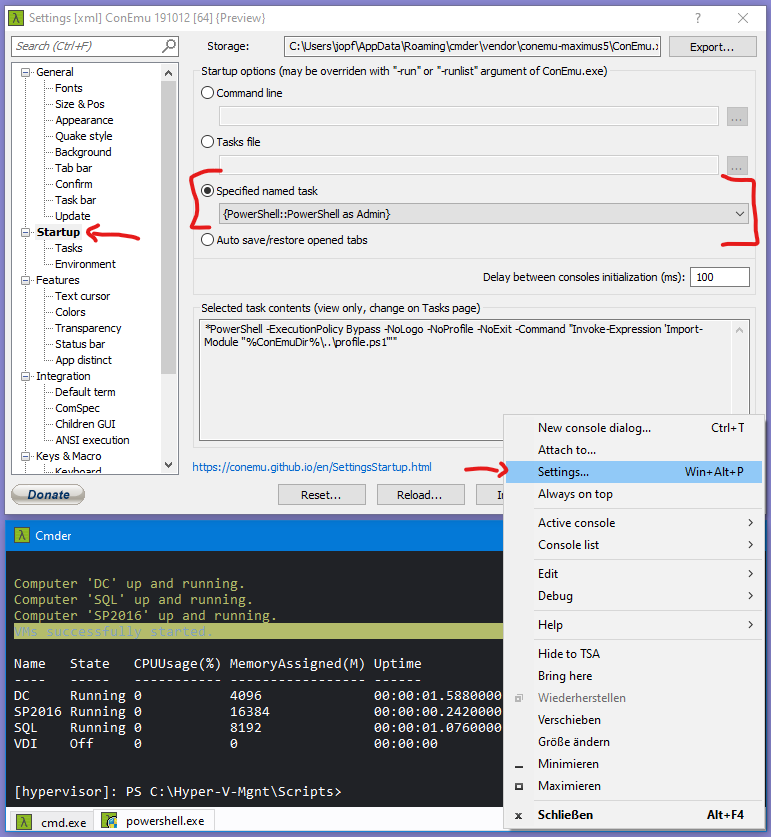

For my daily work I need to do a lot on the command line with Powershell. I'm using cmder for that. But in the default configuration cmder is starting a Windows Console session. Would be much easier if it directly starts a Powershell session instead. Here's how to do that.

<!--more-->

Go to the settings of cmder and change the 'task' of the tab 'Start Up' to the task which is starting Powershell.  
Wow. What a sentence!

Done!  
So long ...
