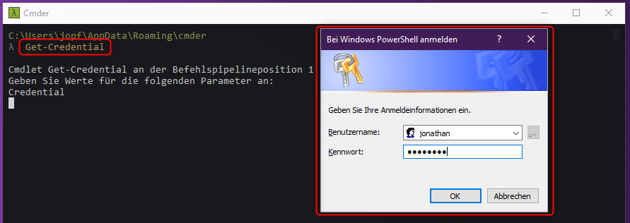
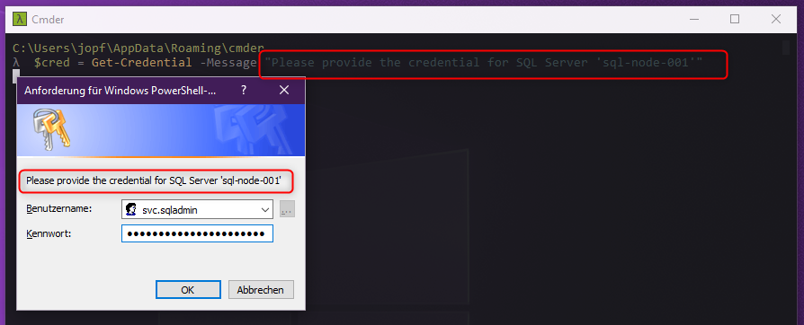

There are often cases with PowerShell, where you need to enter credentials of any kind. Be it while working with Microsoft 365 or any other kind of service which needs authentication.

With PowerShell you have several options - depending on the modules you are using.



## The most common one

```powershell
$myFancyCredential = Get-Credential
```

This will have a pop up appearing on the screen where you can enter your credentials.  
Usually you will have the credentials stored in a variable so you can work with them in your script.

But more often then never you will create a script with some kind of automation in mind. So, waiting for a prompt to enter your data is not the most pleasant option.

## Using PowerShell Credentials for automated scripting

```powershell
$user = "homer.simpson@nuke-springfield.com"
$pswd = "MmmDonutsRN1ce!" 
$secPswd = ConvertTo-SecureString $pswd -AsPlainText -Force 
$cred = New-Object -TypeName "System.Management.Automation.PSCredential" -ArgumentList $user,$secPswd 

# Login into an example service 
Connect-SpringfieldNukeService -Credential $cred
```

In a first step your are going to store all relevant data inside of variables. Then you can use the **ConvertTo-SecureString** command to encrypt the password so the **PSCredential** object is able to use it.

So said, we create a **PSCredential** object and passover the user and the secured password. Now we can use the credential object to authenticate against our services.

The downside of this approach is, that we have a valid password stored inside of a script in a very, very unsafe way. And this brings us to the next option.



## Let PowerShell ask for the password

Imagine the following - not very uncommon - situation in real life.

You are working as an external consultant for a client company. You need to create a script for automating some tasks because you are not allowed to do anything on the clients productive system. It is very unlikely that the client will give you any kind of user and its credentials to run your script remotely. So an agreement was made: You will create the script in your dev/test/what-ever environment, but the client will execute the script - after an extensive review process of cource - on his production environment.

The approach for this is fairly simple. At the beginning of our script we will ask for any credentials we need within the script. One for the online service we need to access, another one for the SQL Server On-Prem and one for another thingy.

```powershell
$cred_sqlnode01 = Get-Credential -Message "Please provide the credential for SQL Server 'sql-node-001'" 
```

Any of those credentials can be stored in a variable and can then be used anywhere within our script.

Everyone is happy. The client, because he does not need to grant access to his production environment and the consultant, because he had not too much pain creating a solution in this setup.

I hope you are happy, too. And you could take something with you from this chapter of PowerShell and working with credentials.

So long...
