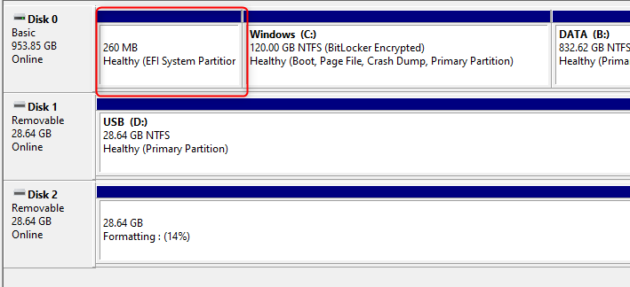
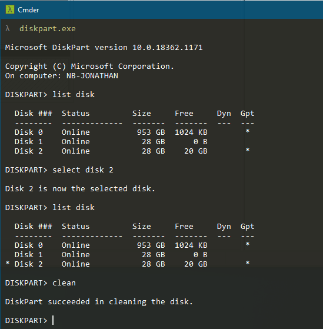
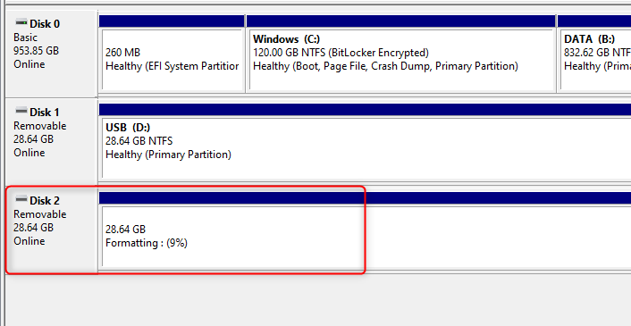

Lately I found a USB stick in my drawer which I once used to setup a bootable Windows 10. 
  
Good for me as I just needed some extra GB of storage.  
  
Bad for me as the bootable setup of the stick has an EFI system partition on it which I could not easily remove by using my Windows-10-Computer-Management-Storage-Disk-Management approach.

As I wanted this stick to be clean and fully usable I had to go another way.

EFI System partition looks similar to this one

## diskpart to the rescue

So let’s switch to our good console and start with calling **diskpart.exe** .

Next step is to identifiy the correct disk. This is important as using diskpart does not forgive any mistakes. So let’s see which disks we actually have attached to our machine by typing **list disk**.

You can cross-check the correct disk by using the _Disk Management Snap-In_ under Computer Management.

In my case it’s disk 2 I want to modify. So I type in **select disk 2**.

You can check if you have selected the correct disk by typing **list disk** once again. The selected disk will be marked with a star in front of its name.

Now comes the part to reset the disk and remove anything which is on it.

Cleaning process in on shot

Type **clean** and everything on the selected disk will be deleted.

This cannot be undone so make sure you know what you are doing - including making backups of the data on this USB disk if required.

Leave _Diskpart_ by typing **exit**.

## Create a new volume

You could now stay on the console and use _fdisk_ to create a new volume on the disk and format it properly.

But I’m lazy and going to use the _Disk Management Snap-In_ to do that task.

Creating and formatting the new volumen

In the end I have a clean USB stick - like it just comes out of factory - ready to be filled with valuable information (e. g. images of rotting sticks)

Hope this helps.  
So long…
