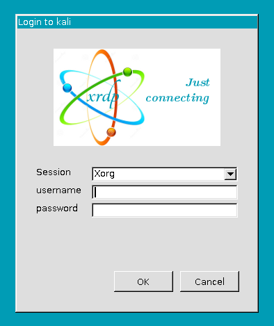

I setup a Kali linux in my lab environment for testing and evaluation purposes. The whole test lab is running on an isolated hypervisor solution.

And therefore it would be nice to have the possibility to log into Kali via RDP.  
Let's see how to do this.

In my case I have a brand new installation of Kali Linux 2021.2 on my Hyper-V. I'm going to use xrdp to have me log into the machine.  
So let's install that first

```bash
$ sudo apt-get update 
$ sudo apt-get install xrdp 
```

Next we want to start the service

```bash
$ systemctl start xrdp 
$ systemctl start xrdp-sesman 
```

Let's see if it's working and try log into the machine with an RDP client on Windows.  
In my network the machine is accessible via its hostname kali or the IP 10.0.0.100 .

```powershell
mstsc /v kali
#or 
mstsc /v 10.0.0.100 
```



To have the RDP service started automatically after a reboot do this once

```bash
$ systemctl enable xrdp 
$ systemctl enable xrdp-sesman
```

Now you can log into Kali Linux and do what ever you intended to do.  

One last point. Make sure you are not logged in anywhere else - e.g. Hyper-V Manager. Otherwise this will prevent the RDP client to take over the session. Haven't found a way around this yet.

If you have a solution for this at hand, let me know in the comments.

So long...
