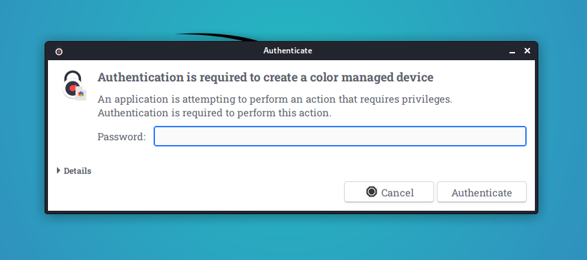

Many Debian based Linux are using PolKit to enforce specific policies within linux. Some of these policies are extra rigid in terms of using RDP. Therefore, while using RDP you will get numerous popups asking for credentials. And this makes working remotely really annoying.

## Table of content 




I found a pretty good article here [\[1\]](#references) which describes the root cause and a way to resolve this issue. In my post I'm going to condense the solution part for later reference.

So let's have a look.

## How to get rid of it?

The solution to that issue is, that we have to tell PolKit how to behave if a user is working remotely via RDP. And this can be done with a specific file in the folder /etc/polkit-1/localauthority/50-local.d/ .

Here are the steps:

### 1\. Become root on the terminal as some resources require that special permissions.

```bash
(john@kali) $ sudo -i
[sudo] password for john:

(root@kali) #
```

### 2\. Check which version of pkaction (PolKit) is running.

```bash
(root@kali) # pkaction --version 
pkaction version 0.105 
```

If the version number is 0.106 or higher (=>0.106) => create a \*.conf file.  
If the version number is smaller than 0.106 (<0.106) => create a \*.pkla file.

### 3a. Create a \*.conf file (pkaction --version >= 0.106)

```bash
(root@kali) # cd /etc/polkit-1/localauthority.d.conf
(root@kali) # touch 02-allow-color.d.conf
(root@kali) # nano 02-allow-color.d.conf
```

Add the following content to this file and save it.

```javascript
polkit.addRule(function(action, subject) {
 if ((action.id == "org.freedesktop.color-manager.create-device" ||
 action.id == "org.freedesktop.color-manager.create-profile" ||
 action.id == "org.freedesktop.color-manager.delete-device" ||
 action.id == "org.freedesktop.color-manager.delete-profile" ||
 action.id == "org.freedesktop.color-manager.modify-device" ||
 action.id == "org.freedesktop.color-manager.modify-profile") &&
 subject.isInGroup("{users}")) {
 return polkit.Result.YES;
 }
 });
```

### 3b. Create a \*.pkla file (pkaction --version < 0.106)

```bash
(root@kali) # cd /etc/polkit-1/localauthority/50-local.d/
(root@kali) # touch 45-allow-colord.pkla
(root@kali) # nano 45-allow-colord.pkla
```

Add the following content to the file and save it.

```bash
[Allow Colord all Users] Identity=unix-user:* 
Action=org.freedesktop.color-manager.create-device;org.freedesktop.color-manager.create-profile;org.freedesktop.color-manager.delete-device;org.freedesktop.color-manager.delete-profile;org.freedesktop.color-manager.modify-device;org.freedesktop.color-manager.modify-profile; 
ResultAny=no 
ResultInactive=no 
ResultActive=yes
```

### Test the configuration

Now try to login via RDP to your machine. No popup should be visible and asking for any kind of credentials.

I highly recommend to read the original article [\[1\]](#references) as you will find very useful infos to understand the mechanism behind this behaviour and the proposed solutions.

## References

[\[1\] "xRDP - The Infamous 'Authentication Required to Create managed Color Device' Explained" | Griffon's IT Library (2021-Mar-22)](https://c-nergy.be/blog?p=12073)
