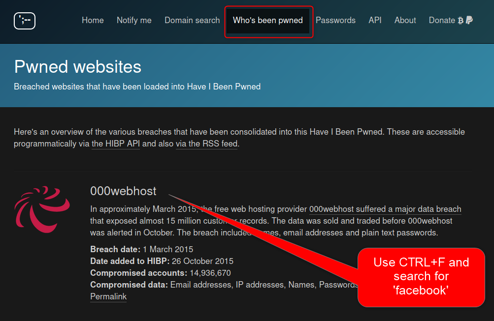
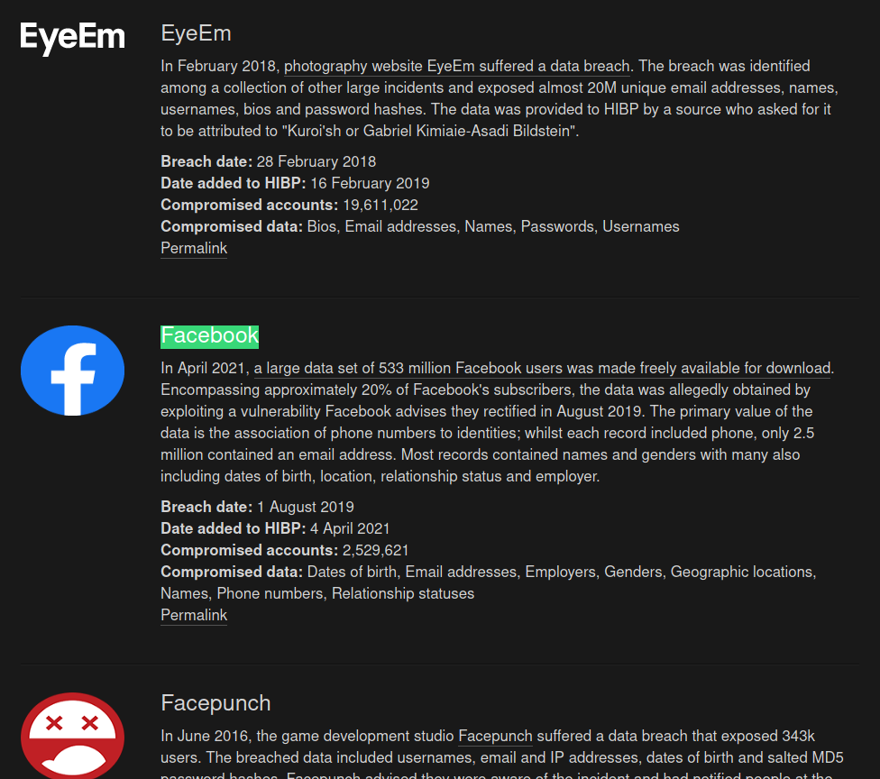

Again a massive data leak happened leaving millions of user data exposed to criminal intentions. This time: **Facebook**.  
Actually a company is obliged to inform any user, if they suspect that user data have been lost and are now openly accessible in the internet. But I would not count on that.

So what shall I do if I think my data has gone wild?
<!--more-->
## Table of content 


## Back to the roots

First of all: If you think your account data have been compromised, change them.

Change your **password** and change your **password recovery contact**. Maybe a little bit paranoid but so what?

## Got any info regarding the data leak?

Check if you have received any information from the company - in this case Facebook. They probably give you some advice what data have been lost and what to do next.

## Have I Been Pwned?

"Have I Been Pwned?" (HIBP) [\[1\]](#references) is a good place to start investigations whether an email account or a password has been compromised. The database consists of various data leaks and can be searched for checking custom passwords and/or e-mail addresses.

Here's how:

The first thing we need to know is, if HIBP already has the data of the leaked incident added to its database.

Now let's check if our account is listed.  
Oh no! My email has been compromised. Better I'll check everything where I used that email address.

Let's check another one.

Awesome. This is what a request should look like. Everything green.

## Best practices

- Do not use the same password for different accounts
- Double check the information you are providing to 3rd party services
- Change your credentials on a regular base
- Keep an eye open for news about recent data breaches

## Conclusion

Losing personal data is always a pity. Even using a strong password cannot help you, when Facebook is not able to keep your data save.

## References

\[1\] ["Have I Been Pwned?" (2021-04-03)](https://haveibeenpwned.com/)

Happy eastern and 'til next time.
