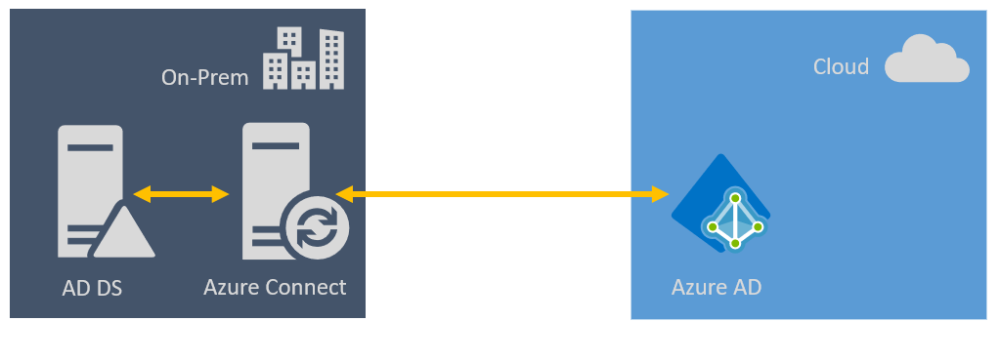

As Identity Management takes care of user accounts, permissions and machines it is a pretty sensitive topic by nature. Therefore, let's have a look at this.

For Microsoft 365 we have Identy Management in two different flavours: Cloud-Only and Hybrid.

## Cloud Only

When we are talking about Cloud Only all users, groups and computers are managed in Azure AD. The authentication is also done via Azure AD.

Especially for smaller companies which don't have any kind of on-prem infrastructure this is a pretty good starting point to have everything at one place.

Creation of users, assignment of licenses or configuration of services, applications and mobile devices (MDM) can be done either by using PowerShell or the Web UI.

## Hybrid

The Hybrid approach is used best in case an existing on-prem infrastructure needs to be integrated into an upcoming cloud solution.

In a Hybrid solution we are dealing with AD DS (on-prem) and Azure AD (cloud). AD DS and Azure AD are connected by using Azure AD Connect. A service which is running on a machine on-prem.

In this scenario a copy of the AD objects from on-prem will be created in Azure AD. This copy is updated on a regular base by Azure AD Connect.

### Anything to keep an eye on?

- before you start with any kind of AD synchronisations, invest some time in housekeeping tasks and clean up your directory
- primary management of Active Directory will be done on-prem
- you might probably need to update AD Object Attributes
- you might think about using 'ID fix for AD DS'

But wait. There is more!  
There are different types of the hybrid model: [Managed Type with PHS](#managedtypewithphs), [Managed Type with PTA](#managedtypewithpta) and [Federated Authentication](#federatedauthentication).

Let's check out what this is about.

## Managed Type with PHS

PHS stands for 'Password Hash Synchronisation'.  
If you consider using this type: Authentication is done online via Azure AD.

Implementation is fairly easy and you have the benefit of using the same credentials for on-prem and Microsoft 365 services.

## Managed Type with PTA

Relax. It has nothing to do with school or parenting.  
PTA means 'Pass Through Authentication' and is the second authentication method which can be used for Hybrid scenarios.

The authentication is handled by AD DS for both - on-prem and cloud.  
The biggest advantage is probably that any changes have immediate effect.

For having PTA implemented there needs to be an agent installed running on a server.

## Federated Authentication

There is a third option to handle authentication. And this is probably the most common/recommended installment of authentication when we have to deal with a hybrid setup. Federated Authentication.

This one usually takes action as soon as we have more complex security requirements like usage of Smart Cards, MFA, Single Sign On, …

To be honest the implementation is way more complex and takes more effort than Managed Type with PHS/PTA, but I thing at least in enterprise environments you don't want to have anything else.

Keep in mind that you need an AD DS and Federation Services implementation for this. Also the overal infrastructure required for this solution is usually more complex.

## Conclusion

Microsoft 365 provides a complete Identity Management portfolio to handle almost any kind of security requirement. Though it's worth to think twice upfront before starting anything just to make sure to go the right path.

## References

\[0\] "[Office 365 identity models and Azure Active Directory](https://docs.microsoft.com/en-us/microsoft-365/enterprise/about-microsoft-365-identity?view=o365-worldwide)" | Microsoft Docs  
\[1\] "[Azure AD Connect and Azure AD Connect Health installation roadmap](https://docs.microsoft.com/en-us/azure/active-directory/hybrid/how-to-connect-install-roadmap)" | Microsoft Docs  
\[2\] "[Choose the right authentication method for your Azure Active Directory hybrid solution](https://docs.microsoft.com/en-us/azure/active-directory/hybrid/choose-ad-authn)" | Microsoft Docs
