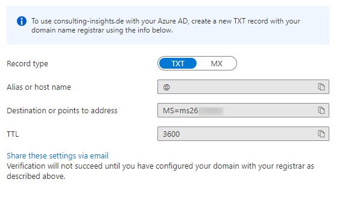
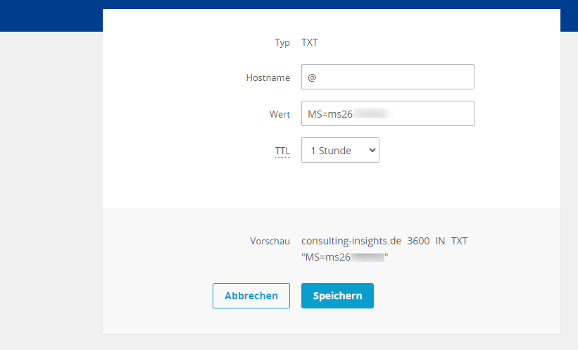

When creating an Azure Subscription in a first place you just have a non-speaking default Microsoft domain assigned to your subscription. Usually you want to have your own domain asigned to you subscription. Here's how you do that.

<!--more-->

## Azure Portal

Log in to your Azure Portal with an administrator account, switch to Azure AD and select Custom domain names.  
Here you can add the domain you want to assign to your Azure subscription.  
After you added the entry, you will be prompted some information for validation that the domain actually belongs to you.

You can choose between two settings to verify your ownership of the domain: Creating a TXT record or creating a MX record in the DNS settings for your domain. I'll choose TXT as we're not going to configure anything mail-related (that's what MX is actually for).  
Keep that page open as we will shortly click on 'verify' on this page.

## DNS settings of your provider

Depending on where you have your domains managed, open the management page for DNS settings from your provider.  
Add a new DNS TXT record and copy paste the entries provided from the Azure. This should be a value for host, content and TTL.

After you created that record in your DNS entries switch back to the page in Azure Portal which we kept open.  
Click on verify. A success message should appear instantly if everything was configured correctly.

Now you have your custom domain available within your Azure subscription and you can - for instance - start creating users with that domain in their login name.

Well, that's it folks.  
So long...
