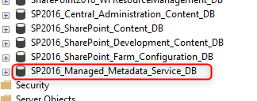

Sometimes you need to move a SharePoint web application to another farm. Quite often you also need to move the Managed Metadata Service Application to that farm, too. Properly because the web application depends on the taxonomy stored in the MMD Service Application.

So let's take a look on how to do that.

<!--more-->

## The steps

1. Make a backup of the service database in SSMS
2. Restore the backup in the new environments SQL Server  
    And here comes the trick: Keep an eye on the name of the service database. As soon as we are creating the Managed Metadata Service Application in the new farm, we will have to use that exact name.
3. Create a new Managed Metadata Service Application in your new farm and use the exact name of the database you just restored on SQL.



```powershell
# Create the service 
$newMMD = New-SPMetadataServiceApplication -Name "Managed Metadata Service Application" -ApplicationPool "Default Service Application Pool" -DatabaseName "SP2016_Managed_Metadata_Service_DB" -DatabaseServer "mysqlserver.domain.tld" -AdministratorAccount "domain\mmd.admin" -FullAccessAccount "domain\mmd.fullaccess" -ReadAccessAccount "domain\mmd.reader"
```

Using the name of an existing database tells PowerShell to use that one instead of creating a new (empty) one.

Now, let's create the proxy app

```powershell
# We will use the MMD object from the statement above 
New-SPMetadataServiceApplicationProxy -Name "Managed Metadata Service Application Proxy" -ServiceApplication $newMMD -DefaultProxyGroup
```

Well, that's it.

Would you do this in the same way? Or is there a more elegant solution?  
Let me know in the comments.

So long...
