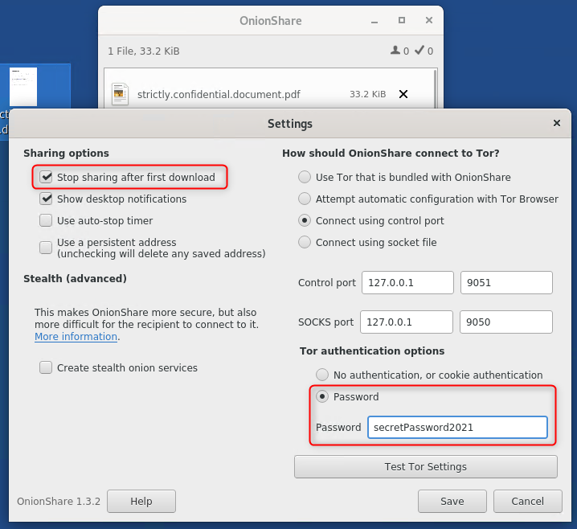
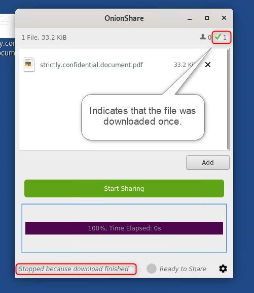

Read this brief introduction in using Onion Share for private file sharing. 

<!--more-->
## Table of content 


["Pentagon Papers"](https://www.nytimes.com/interactive/2021/06/09/us/pentagon-papers-oral-history.html). The first massive "data leak" of modern times turned 50. A good opportunity to ask yourself, how would such a data leak be done today with all the digital possibility and surveillance?

_\[Disclaimer: I'm pretty aware that using this technique is not bulletproof as several studies of the past few years showed - but it's one way.\]_

## Ogres are like onions

That said, let's have a look at the Tor network. A battle-proofed - nevertheless not 100% secure - hidden network system to access data via the internet. But still more secure than sharing your data via E-Mail or Filesharing services like DropBox.

## Whats the scenario

Let's say we have an employee of a pharma company who was able to obtain heavy evidence that his company is performing illegal medication testing on people in the third world area. Let's add some espionage thriller content and assume the government has knowledge about these actions and reaching out to the local judiciary is no good as the employee does not want to uncover her identity.

So the employee decided to leak that data with the press. Already contacted a well-known journalist and agreed in sharing the evidence. But how to keep anonymous while sharing the data?

## Share the data via "Onion Share"

What do we need?  
The employee is using a Tails Linux on a stick to minimize her digital footprint. For sharing the information she is going to use "Onion Share", a temporary sharing system leveraging the Tor Network. For communication she uses Signal.

The journalist is also using a Tails Linux. For receiving the files he uses the Tor browser and for communication he also uses Signal.

## The steps

The employee and the journalist agree on a specific time when the file will be provided online.

The employee starts Onion Share on her running Tails Linux, configures the options and starts sharing the file.

After clicking on share, a random URL is generated. The employee shares this URL via Signal with the journalist. The journalist types this URL into his Tor browser running on his machine (the left machine in the screenshot).

A download page opens and the journalist can download the file provided by the employee. After the download has finished instantly the link becomes invalid to prevent others to use the link for downloading the file again. (That's the reason why it makes sense to do that stuff in real-time.)

The journalist copies the file to a USB stick and directly shuts down his machine.  
The employee is doing the same.

You can additionally try using an open network like McD's or any other coffee shop to make it harder to specifically listen to your network traffic.

## And now...

... good luck and good night!
