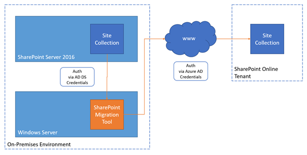

Some people state that SharePoint on-prem is dead (actually not my opinion - but here we go). And in fact, a lot of customers consider using SharePoint Online instead. But how do I get all my data from my local environment to the cloud?

<!--more-->

## Choose your weapon

There are plenty of tools that you can use to get your stuff from on-prem to online. But it's worth taking a step back and evaluating the tools based on your requirements.

Microsoft itself provides a migration tool that covers most of the common tasks related to a SharePoint migration for free. The \[0\]"SharePoint Migration Tool". And today we're going to have a brief introduction to that tool.

**Note** | SharePoint Migration Tool vs. Migration Manager | Don't get confused with the Migration Manager - also provided by Microsoft. The Migration Manager is used for migrating file shares to SharePoint Online and/or OneDrive4Business.

## How does the SharePoint Migration Tool work?

The SharePoint Migration Tool is used as some kind of broker between the on-prem SharePoint Server farm and the SharePoint Online tenant. It reads the data from the on-prem farm and copies them to the SharePoint Online tenant based on specific rules defined within the tool itself.

Architecture SharePoint Server Migration

The configuration and management of the migration jobs can be done by a UI provided by the tool itself. For the sake of automation, you can also use PowerShell commands to make your own scripts, which is especially nice in more complex and bigger environments.

## Summary

Microsoft provides a free tool for the migration of data from a SharePoint on-premises farm to SharePoint online which is definitely worth having a closer look at. And with the ability to be used in PowerShell this solution also provides flexibility for more complex scenarios.

## References

- Microsoft Docs | [Migration Manager and SharePoint Migration Tool solutions posters](https://docs.microsoft.com/en-us/sharepointmigration/migration-solution-posters)
- Microsoft Docs | [How the SharePoint Migration Tool works](https://docs.microsoft.com/en-us/sharepointmigration/how-the-sharepoint-migration-tool-works)
