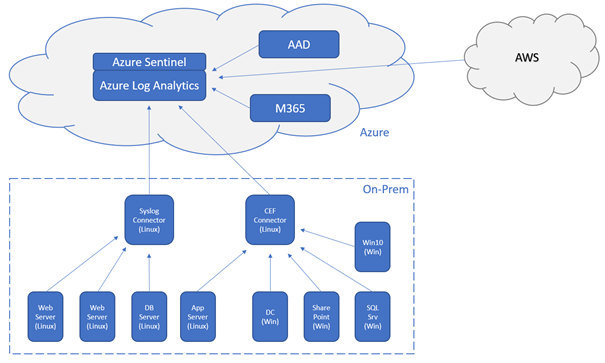

Azure Sentinel is a cloud-based "Security Information and Event Monitoring" from Microsoft.

The IT landscape is undergoing constant change. And with all the resulting advantages, of course, come disadvantages and risks.  
One of these disadvantages is the enormous complexity and size of today's environments. Especially hybrid scenarios with combinations of on-prem networks and the cloud can cause you to quickly lose track of the state of servers, firewalls and clients. And if you lose track of your systems, threat actors often have an easy game.

In order not to lose track, Microsoft helps us with Azure Sentinel as a central hub where all information converges.

## How Azure Sentinel works

In order to not have to dive too deeply into the architecture of Microsoft Azure, we will simply consider Azure Sentinel as the one point where all logs and security messages are bundled. Technically, this is accomplished through a variety of connectors. Additionally, Azure Sentinel supports security teams with AI-powered analysis of the data and recommendations for appropriate responses or automated countermeasures in the event of a breach.

### Merging the log files

The larger the environment, the more machines and components there are to manage. Accordingly, a lot of log information comes together.

So the first step is to collect all this information in one central point.

Azure Sentinel uses Azure Log Analytics for data management. The information can come from Azure Services, Microsoft 365, third-party cloud services (e.g. Google, Amazon, …) - but also from on-prem resources (Windows, Linux, Mac). Thus, almost the entire range of possible source systems for log files is covered.

There are different options for integrating the systems into Azure Sentinel. Depending on the requirements, agents can be installed on the source systems, for example, which are connected either directly to Azure Sentinel or via a proxy system (collector). Communication takes place either via HTTPS or also via Syslog over TLS. The common formats Syslog (originally from the Linux world) and CEF (Common Event Format) are integrated.

Some systems, such as Barracuda or Symantec, can be connected via a REST API.

**INFO** | The Collector can be installed and configured both on-prem and directly in Azure on a Linux machine. The configuration can be done for Syslog and CEF on one machine - but it is easier and less error-prone to set up one machine for Syslog configuration and one for CEF configuration.

Architecture (example)

Finally, the log data in Azure is merged into an Azure Analytics Log Workspace. Azure Sentinel uses this workspace as a data source.

### Evaluating the data

Once the log data is available in Azure Sentinel after the connectors have been configured, it is analyzed either automatically (AI-supported) or manually using a query language called KQL.

Predefined workbooks (analysis and visualization definitions), which filter for errors, IOCs (Indicators of Compromise) or anomalies, among other things, based on the most common requirements, help here. Workbooks can be customized individually or created from scratch.

The support of artificial intelligence minimizes "false positive" messages. And this helps the security team to focus on relevant events instead of "chasing ghosts".

### Root cause analysis and countermeasures

If a red flag is raised, it is of course good to know why. Azure Sentinel also supports the security team here with the help of AI. Suspicious behavior of user accounts or the sudden movement of large amounts of data can be indications of a compromise. Azure Sentinel shows whether these or other "anomalies" are present based on empirical values from other Azure users or also from the Microsoft Security Teams (e.g. Microsoft Security Response Center or Microsoft Security Intelligence). In addition, Azure Sentinel can be used to recreate the course of such an incident in order to initiate measures such as user training or hardening of systems, if necessary.

If you know that something has happened, where it happened and why, you can start thinking about countermeasures. In many cases, these countermeasures can be automated. And here, too, Azure Sentinel helps to relieve the security team of work.

Playbooks can be used to automate actions. If a certain condition occurs, Azure Sentinel acts with a defined action. This may sound trivial at first, but in real life it is a powerful sword. It is worth delving deeper into this topic to automate as many tasks as possible. Just think how much time this can save in the triage of security messages alone.

## So why Azure Sentinel?

Of course, Azure Sentinel is not the only SIEM solution on the market - and definitely not the cheapest. However, I recommend that anyone who is serious about cyber security in their organization and who may have already moved to the Azure Cloud, consider Azure Sentinel.

Especially the provisioning of Azure Sentinel as Software as a Service is a big advantage in terms of deployment as well as implementation costs. There is also no need to worry about scaling, as it adapts to the needs of the user.

If you want to take a closer look at the financial impact of Azure Sentinel, I recommend the work of [Forrester Consulting](https://aka.ms/sentinel-tei-report).

It should only be taken into account that the use of Azure Sentinel alone is not enough. You also need qualified personnel who are able to handle this tool. There are certainly enough people willing to learn about this interesting topic.

## Conclusion

The use of Azure Sentinel is not a "quick fix" but a strategic decision. However, if you have decided to include Azure Sentinel in your repertoire, you can greatly minimize the risk from a cyber security perspective and shorten the response time to an attack. And thus also keep potential financial damage to a minimum.

## References

["Azure Sentinel" | Microsoft Official Site](https://azure.microsoft.com/en-us/services/azure-sentinel)  
[„The Total Economic Impact of Microsoft Azure Sentinel”](https://aka.ms/sentinel-tei-report)  
[“Quickstart: On-board Azure Sentinel”](https://docs.microsoft.com/en-us/azure/sentinel/quickstart-onboard)  
[“Plan and manage costs for Azure Sentinel”](https://docs.microsoft.com/en-us/azure/sentinel/azure-sentinel-billing)
