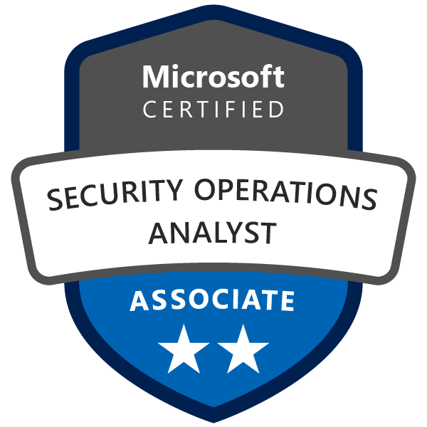

IT Security was always on my list of interests since I started messing around with computers. But lately I decided to focus on this topic and now I'm trying to steer my professional career in this direction, too.

<!--more-->
## Table of content 


The SC-200 certification was part of a giveaway from Microsoft for attending the Ignite last year… well, here we go. I mean, the best thing about taking exams is the knowledge you gain to do so.

**NOTE |** Preparation for certifications is a pretty personal thing. Everyone does it differently. It also depends on what kind of certification one might earn. Is it a Microsoft certification or a CompTIA? What topic will be covered? And so on...  
So this post is about how I prepared and earned my SC-200. Feel free to do whatever you want to do - unless it's something illegal. ;)

## How I prepared for this certification?

There are a lot of people out there - also some of my earlier colleagues - who were thinking it's all about certifications. The more the better. And it doesn't matter how. Therefore many of them went by using brain dumps just to call those certs their own.

Aaand yes, I used to be one of them, too. But I realized this does not give you any added value or prepare you for the work after the certification. Therefore for the last few certifications I attended, I started trying a different approach.

## Get an overview

The first step is to get an overview of what the certification will be about. The topic. The scope. Is it something that will improve my posture at work (don't want to wast time)? So I checked what the SC-200 is about on the Microsoft certification page for exact this certification.

Btw, it aims at Security Operatives (usually working in a CSOC) and covers Microsoft Defender, Microsoft Cloud App Security and Azure Sentinel - with focus on the last one.

## Narrow sources down

Now as we know what topics we need to cover and for what job this certification is, I took a deeper look at how this job would look like. Google it. Read about it. Ask on Twitter or watch some videos on YouTube. There are plenty sources for info about Security Operation Centers. Fortunately I already had a good understanding of what this job would be and what people are doing there. So... less time spend here.

I found some good 2h videos on YouTube which covered on a high level what was requested for the SC-200. This helped me to narrow down the info I need to cover to pass the certification. Or, at least this was what I thought.

## The basics

Next was to get some deeper insights on the topics mentioned above.

Sure, you can get a book and read about it - which will be pretty soon out-dated. Or watch some videos on YouTube, Pluralsight or any other provider of moved-pictures-content. If you are lucky, you might even attend a instructor led training.

Well, I stuck with the [Microsoft Docs](https://docs.microsoft.com/en-us/learn/certifications/exams/sc-200) as those allowed me to learn at my own pace. And don't get me wrong. This is definitely the part which is most time consuming. So I read the docs and did research on those topics I didn't understand or where I was thinking I might need some extra background knowledge.

## The practical stuff

While reading all the theory, you might want to get some first on-hands experience. I used the developer accounts of Microsoft Azure and Microsoft 365 for this. Unfortunately, some features are pretty limited. For me this was the case with Azure Sentinel and some more complex set ups like multi-tenant scenarios or inclusion of AWS and/or GCP.

## My experince with the SC-200

The test itself was very different from what I expected to see. I thought there would be more questions specific about security products like Sentinel and Defender (in all of its shades) but instead I was forced with a lot of Azure infrastructure questions - which I was lucky and could answer due to my already acquired experience with Azure. But there were also some quite specific KQL related topics which you probably can only answer best, when you already have spent some time working in this industry. In my case there were probably some good guesses, I think.

Anyway. The best recommendation I can give you is: Study. Study the theory and do as many practical exercises as you can do. And most important: Take your time. This way you can pass the certification AND get some first experience.

Well. That's all so far.
