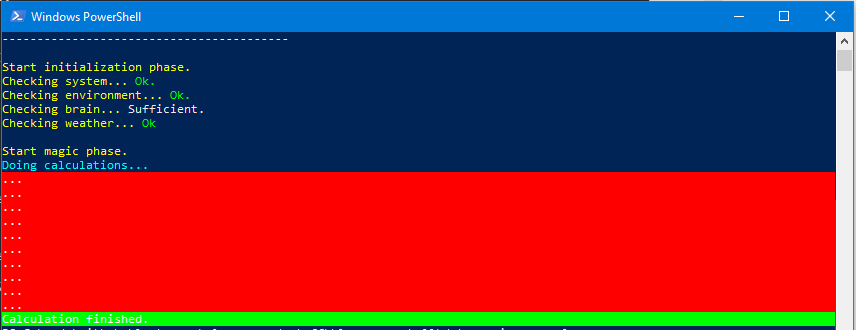

Many people write one single script in PowerShell, where parts of the logic are put in functions. Totaly valid. But room for improvement.

<!--more-->
## Table of content 


Especially when you start to write scripts in a team, it's better to keep the logic separated in different files. In combination with a version control system, it makes modifications easier and less error-prone.

## The all-in-one script

```powershell
<#
  My Super dooper awesome demo powershell script 
  This is going to be rad. Bloody amazing! Changing the world.  
#>

# Show the header of this script  
Clear-Host 
Write-Host "-----------------------------------------"
Write-Host "Hello awesome Johnny. Here's your script!"
Write-Host "-----------------------------------------"
Write-Host 


# Start initialization of stuff 
Write-Host "Start initialization phase." -ForegroundColor Yellow
Write-Host "Checking system... " -ForegroundColor Yellow -NoNewline
Write-Host "Ok." -ForegroundColor Green
Write-Host "Checking environment... " -ForegroundColor Yellow -NoNewline
Write-Host "Ok." -ForegroundColor Green
Write-Host "Checking brain... " -ForegroundColor Yellow -NoNewline
Write-Host "Sufficient." -ForegroundColor DarkYellow
Write-Host "Checking weather... " -ForegroundColor Yellow -NoNewline
Write-Host "Ok" -ForegroundColor Green
Write-Host 


# Do the magic - in this case fake but ok 
Write-Host "Start magic phase." -ForegroundColor Yellow
Write-Host "Doing calculations... " -ForegroundColor Cyan 
for ($i = 1; $i -le 25; $i++) {
    Start-Sleep -Milliseconds 50 
    Write-Host "... " -ForegroundColor White -BackgroundColor Red
}
Write-Host "Calculation finished." -ForegroundColor White -BackgroundColor Green 
```

And there is nothing wrong with doing so. But let's see what else can be done.

## The variables

Sooner or later you will notice there can be done a lot more with variables. So the list-of-commands-script will be made 'reusable' by throwing in some variables. Nice.

```powershell
<#
  My Super dooper awesome demo powershell script 
  Now with the all new usage of variables!!! \m/   
#>

$scriptusername = "Johnny"  # <-- There it is!
$numberOfCalculations = 50  # <-- And here another one!

# Show the header of this script  
Clear-Host 
Write-Host "-----------------------------------------"
Write-Host "Hello awesome $scriptusername. Here's your script!"
Write-Host "-----------------------------------------"
Write-Host 


# Start initialization of stuff 
Write-Host "Start initialization phase." -ForegroundColor Yellow
Write-Host "Checking system... " -ForegroundColor Yellow -NoNewline
Write-Host "Ok." -ForegroundColor Green
Write-Host "Checking environment... " -ForegroundColor Yellow -NoNewline
Write-Host "Ok." -ForegroundColor Green
Write-Host "Checking brain... " -ForegroundColor Yellow -NoNewline
Write-Host "Sufficient." -ForegroundColor DarkYellow
Write-Host "Checking weather... " -ForegroundColor Yellow -NoNewline
Write-Host "Ok" -ForegroundColor Green
Write-Host 


# Do the magic - now with a defined number of calcs 
Write-Host "Start magic phase." -ForegroundColor Yellow
Write-Host "Doing calculations... " -ForegroundColor Cyan 
for ($i = 1; $i -le $numberOfCalculations; $i++) {
    Start-Sleep -Milliseconds 50 
    Write-Host "... " -ForegroundColor White -BackgroundColor Red
}
Write-Host "Calculation finished." -ForegroundColor White -BackgroundColor Green 
```

But after some time, you will have several 'scripts' with variables - all doing similar stuff or at least within the same topic.

This is where functions come to play.

## Using functions

Functions are what the name's promising to be: Functions.

Your script will now continue with a header section where several variables are defined, a section where your functions will live and the end where the functions are called in the order which is suitable for your needs.

```powershell
<#
  My Super dooper awesome demo powershell script 
  Look out: I know functions!    
#>

$scriptusername = "Johnny"
$numberOfCalculations = 50

function Write-BTHeaderContent {         # <-- That's what a function
    param (                              # <-- looks like
        $ScriptUserName                  # <-- Here's the parameter
    )
    # Show the header of this script  
    Clear-Host 
    Write-Host "-----------------------------------------"
    Write-Host "Hello awesome $ScriptUserName. Here's your script!"
    Write-Host "-----------------------------------------"
    Write-Host 
}


function Start-BTInitialization {
    # Start initialization of stuff 
    Write-Host "Start initialization phase." -ForegroundColor Yellow
    Write-Host "Checking system... " -ForegroundColor Yellow -NoNewline
    Write-Host "Ok." -ForegroundColor Green
    Write-Host "Checking environment... " -ForegroundColor Yellow -NoNewline
    Write-Host "Ok." -ForegroundColor Green
    Write-Host "Checking brain... " -ForegroundColor Yellow -NoNewline
    Write-Host "Sufficient." -ForegroundColor DarkYellow
    Write-Host "Checking weather... " -ForegroundColor Yellow -NoNewline
    Write-Host "Ok" -ForegroundColor Green
    Write-Host     
}


function Invoke-BTMagicStuff {
    param (
        $TimesOfCalculations
    )
    # Do the magic - in this case fake but ok 
    Write-Host "Start magic phase." -ForegroundColor Yellow
    Write-Host "Doing calculations... " -ForegroundColor Cyan 
    for ($i = 1; $i -le $TimesOfCalculations; $i++) {
        Start-Sleep -Milliseconds 50 
        Write-Host "... " -ForegroundColor White -BackgroundColor Red
    }
    Write-Host "Calculation finished." -ForegroundColor White -BackgroundColor Green 
}

Write-BTHeaderContent -ScriptUserName "dfhgdfhgdfhg"
Start-BTInitialization
Invoke-BTMagicStuff -TimesOfCalculations $numberOfCalculations
```

The script will use **dfhgdfhgdfhg** instead of the way more excellent name of **Johnny** as it is passed directly to the function as a parameter.

This is often the point where many people say: "Wow! Now I can script in PowerShell. Good for me!"

Though it's good enough for most stuff, this is not even the tip of the iceberg.

## . sourcing (dot sourcing)

If you have a developer background you might wonder and ask yourself:  
Is this the way people are writing bigger scripts in PowerShell? Everything in one single file?

**Noooooo. Of course not.**

Imagine the mess when multiple people are editing the same script simultaneously in one file - even under source control.

**Note |** Btw, simultaneously editing content is provided by SharePoint in combination with Office formats like Word and Excel. Check it out to play with the cool kids. ;)

For PowerShell we are using a technique called . sourcing.You can think of . sourcing like having one starting point (think of it as main.ps1) and one \*.ps1 file for each function linked together.

When the script loads the first time, all the definitions of functions and variables are stored in memory and executed as defined in the script files.

Also, nice one.

## . sourcing - The how-to guide

Using this awesome technique requires some rules to be applied.

1. You need one script file which can be used as starting point. Consider it your "main function" of your script. In my example I'll call it **myawesomescript.ps1**.
2. Create a \*.ps1 file for each function you like to have maintained in a separate file.
3. Put all these files in one folder. In the example **functions**.

```
# Structure of files 
# files don't nessessary need to be named like the function itself
myprojectfolder
|-- myawesomescript.ps1 
|-- functions 
   |-- invoke-btmagicstuff.ps1 
   |-- start-btinitialization.ps1 
   |-- write-btheadercontent.ps1 
```

**Note |** If you ask yourself what this **bt** in the function name and filename stands for, this is for distinguishing reasons. Could be anything. In this case, I chose it for BlueTeamer (my GitHub name).  
PowerShell has one big drawback: The lack of using namespaces. It is likely to have multiple modules loaded in your environment which have similar or the same command names. Therefore, to minimize the risk of having the same names, people tend to add small prefixes. Hopefully, there will be a proper solution for that in the near future.  
There is a workaround by loading the PowerShell module into a variable and calling the function over this variable. Yes, it works. And yes it's ugly like $\*%)/.

```powershell
# Content of write-btheadercontent.ps1 
function Write-BTHeaderContent {
    param (
        $ScriptUserName
    )
    # Show the header of this script  
    Clear-Host 
    Write-Host "-----------------------------------------"
    Write-Host "Hello awesome $ScriptUserName. Here's your script!"
    Write-Host "-----------------------------------------"
    Write-Host 
}
```

```powershell
# Content of start-btinitialization.ps1 
function Start-BTInitialization {
    # Start initialization of stuff 
    Write-Host "Start initialization phase." -ForegroundColor Yellow
    Write-Host "Checking system... " -ForegroundColor Yellow -NoNewline
    Write-Host "Ok." -ForegroundColor Green
    Write-Host "Checking environment... " -ForegroundColor Yellow -NoNewline
    Write-Host "Ok." -ForegroundColor Green
    Write-Host "Checking brain... " -ForegroundColor Yellow -NoNewline
    Write-Host "Sufficient." -ForegroundColor DarkYellow
    Write-Host "Checking weather... " -ForegroundColor Yellow -NoNewline
    Write-Host "Ok" -ForegroundColor Green
    Write-Host 
}
```

```powershell
# Content of invoke-btmagicstuff.ps1
function Invoke-BTMagicStuff {
    param (
        $TimesOfCalculations
    )
    # Do the magic - in this case fake but ok 
    Write-Host "Start magic phase." -ForegroundColor Yellow
    Write-Host "Doing calculations... " -ForegroundColor Cyan 
    for ($i = 1; $i -le $TimesOfCalculations; $i++) {
        Start-Sleep -Milliseconds 50 
        Write-Host "... " -ForegroundColor White -BackgroundColor Red
    }
    Write-Host "Calculation finished." -ForegroundColor White -BackgroundColor Green 
}
```

```powershell
# Content of myawesomescript.ps1 
<#
    This is the starting point of my awesome script
    where I can use all my functions and stuff 
    just like Lego and become the master of 
    scripting the hell out of anything. 
#>

<#
 This part is always the same and loads all the 
 functions defined in files within the folder 
 functions into memory, so they can be used in 
 this 'main script'. 
#>

# Get the location where the script is stored. 
$functionspath = "$PSScriptRoot\functions" 

# Get a list of names of the files containing 
# the functions
$listOfFunctionsName = Get-ChildItem -Path $functionspath -Name

# Load the functions into memory by using "dot sourcing"
# This is done by the leading . 
# Don't get confused with calling scripts like .\script.ps1
# This is something different
foreach ($functionfileName in $listOfFunctionsName) {
    . ("$functionspath\$functionfileName")
}


# Now we can call the functions out of memory.
# And if there are any parameter defined, they 
# can also be used here. 
Write-BTHeaderContent -ScriptUserName "dfhgdfhgdfhg"
Start-BTInitialization
Invoke-BTMagicStuff -TimesOfCalculations 10

# end of the script. 
```

This makes the organization of content much easier and readable.



This is what the example output will look like

## Final thoughts

Of course, there is much more. I'm talking about creating our own modules for packaging and deployment. Preparing functions to properly work with pipes. Logging and error handling. Desired State Configuration and parallel execution of tasks. And so on... it's so much to learn. :D :D :D

Let's be good for now and save those topics for later.

So long.
