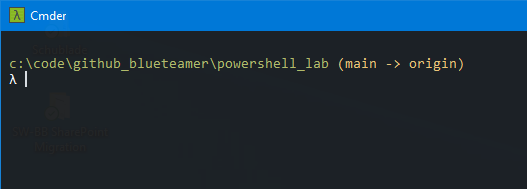
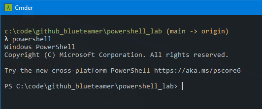
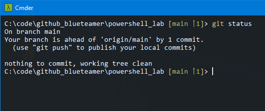

Ah... Git. The version control system that was created by Linus Torvald 'cause he had - again - beef with someone. :) Good. For. Us.

<!--more-->

Git can be used in many different ways. As a console application, as a stand-alone app with GUI or integrated into everyone's most appreciated IDE.

Normally I use Git from Visual Studio Code or my console emulator **cmder**. cmder has git support already implemented. But when I switch to a PowerShell console... nothing.



(main -> origin) in a cmder terminal



Nothing in the PowerShell session

## Making PowerShell git-ready

As you can see in the screenshots above, while using a console with git support does what I would expect, PowerShell does not have this feature implemented out of the box.

For this, we're going to use **posh-git.**

```powershell
# Installing Module (has to be done once only)
Install-Module -Name posh-git -Scope CurrentUser

# Loading the module so we can work with it
# Needs to be done every time we want to us it
Import-Module posh-git 

# To have it load everytime you start PowerShell
Add-PoshGitToProfile -AllHosts
```

Now you have full git support within your PowerShell console.



## Final thoughts

If you are like me and you are using PowerShell more often than the classic command line in Windows, it's a huge relief to have git support also provide in PowerShell.

posh-git does exactly this.

You can find more information about posh-git on the developer's GitHub site here:  
[https://github.com/dahlbyk/posh-git](https://github.com/dahlbyk/posh-git)

So long...
