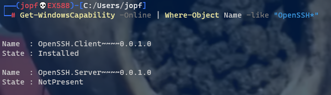
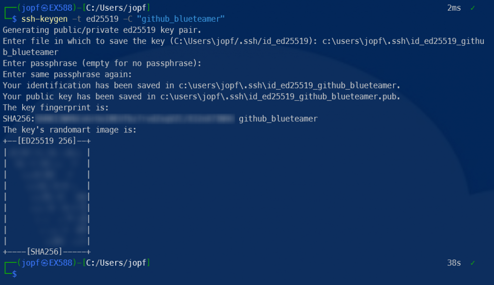
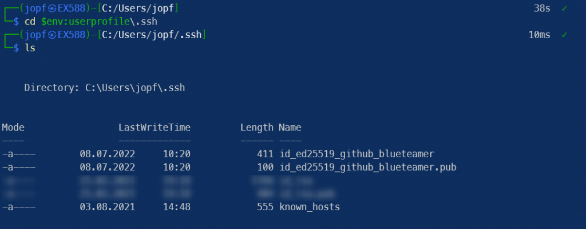
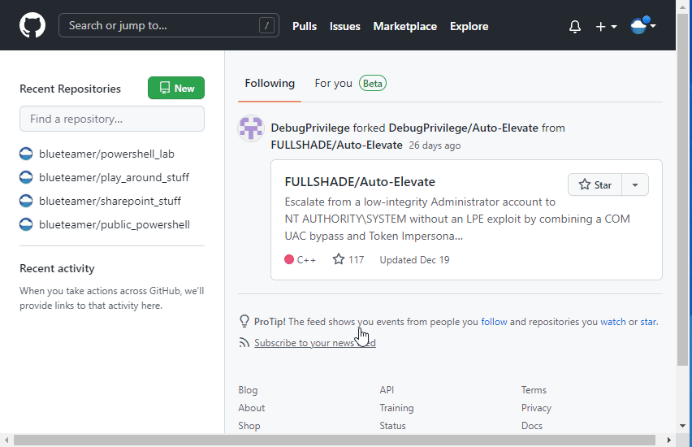

I was explaining this quite often in the last few months to some of my fellow mates, so I decided to just write it down.

<!--more-->
## Table of content 


## What we will assume

In this example, we're assuming that neither OpenSSH nor Git has been installed and configured on our local Windows 10 machine. We're going to cover most of the tasks using PowerShell admin console. Therefore you might need local admin permissions for some of the tasks. Also, we assume that people know how SSH and Git are working. If that's not the case, I'll probably cover this in detail in another post.

So, this is going to be more of a "straight to the point where I can push my committed code to GitHub" explanation.

## Step1: Installing Git

That's fairly easy and should not be a problem. Download the installer for Windows and start the installation process.

You can find the installer [here \[1\]](https://git-scm.com/download/win).

**Note |** Alternatively you can do the installation from the command line/PowerShell by typing **winget install -id Git.Git -e --source winget**

## Step 2: Installing OpenSSH

If you are not sure, whether OpenSSH is already installed, you can check that by typing the following into a PowerShell admin console.

```powershell
# As admin
Get-WindowsCapability -Online | Where-Object Name -like "OpenSSH*" 
```

The result will show you the state of the OpenSSH Client and Server. If not installed there is something like **NotPresent**. If it's already installed it will tell you **Installed**. By the way, we only care for the Client.



In this example, the Client is already installed.

So, assuming the Client is missing, we are going to install it now.

```powershell
# Also as admin 
Add-WindowsCapability -Online -Name 'OpenSSH.Client~~~~0.0.1.0'
```

And that's it. Now we have the OpenSSH client installed on our machine. This means we have access to several OpenSSH tools like ssh, ssh-agent, and key-gen.

## Step 3: Configure SSH-Agent

To make the management of private SSH keys easier (these are the ones you need to authenticate), OpenSSH provides a tool called SSH-Agent. It runs as a service in the background and takes care of storing and handling the private keys.

Installation is already done with Step 2. So let's check if the service is up and running.

```powershell
# Just.. just stay in the admin console 
Get-Service | Where-Object Name -like "ssh*" | select status,name,starttype 
```

The output will show you that the service is **Stopped** and the starttype is **Disabled**.

> Oh no! But we need to have it running and automatically started.

So let's configure the service to our requirement.

```powershell
# Modify the service and start it right up
Get-Service ssh-agent | Set-Service -StartupType Automatic -PassThru | Start-Service
```

When you're calling the command from above again, you will now see that the service is **Running** and the starttype is **Automatic**.

Awesome. We will come back to the SSH-Agent later. But next, we need our SSH key pair.

## Step 4: Generate SSH key pair

To generate the SSH key pair we're using the **key-gen** tool, provided by the OpenSSH Client package.

You need to provide the type of encryption to be used, a comment text (which will be in the public key), an optional passphrase and the name of the file where the keys will be stored. In my example, I will name the files id\_ed25519\_github\_blueteamer. As a result, the two files created will be named

id\_ed25519\_github\_blueteamer  
id\_ed25519\_github\_blueteamer.pub

```powershell
# Generating the keys 
ssh-keygen -t ed25519 -C "github_blueteamer" 
```



Just an example. Paths and values are not real.

The result of this action is, that there are two files in the folder **.ssh** within the userprofile of the current user.



Result of the key generation process

## Step 5: Telling GitHub about the public key

So in order to have GitHub accept our authentication request with our private key, we need to tell GitHub about the public key.

Therefore, we open the https://github.com, login (or register if not already done) and add the content of the public key to GitHub.

```powershell
# Copy the content of the public key to the clipboard for Ctrl + V action
cat $env:userprofile\.ssh\id_ed25519_github_blueteamer.pub | clip
```



Demonstration of adding a public SSH key

## Step 6: Adding the private key to SSH-Agent

Remember the SSH-Agent from Step 3? Here it comes again.

```powershell
# Adding the private key to SSH-Agent using ssh-add 
ssh-add $env:userprofile\.ssh\id_ed25519_github_blueteamer 
```

Now everything is set up to use GitHub with SSL.

## Step 7 (optional): Telling git to use OpenSSH

Though the steps above are sufficient for working from the command line and PowerShell console, there is one step left to properly use Git and GitHub in tools like Visual Studio Code. Telling Git to use OpenSSH. This is done by modifying the Git config.

```powershell
# Change the SSH command in git config 
git config --global core.sshCommmand C:/Windows/System32/OpenSSH/ssh.exe 
```

That's it, folks. Enjoy and so long...

## References

- **[Download for Git](https://git-scm.com/download/win)** (Git download page)  
    \[https://git-scm.com/download/win\]
- **[Install OpenSSH](https://docs.microsoft.com/en-us/windows-server/administration/openssh/openssh_install_firstuse#install-openssh-using-powershell)** (MS Docs)  
    \[https://docs.microsoft.com/en-us/windows-server/administration/openssh/openssh\_install\_firstuse#install-openssh-using-powershell\]
- **[Connecting to GitHub with SSH](https://docs.github.com/en/authentication/connecting-to-github-with-ssh/about-ssh)** (GitHub Docs)  
    \[https://docs.github.com/en/authentication/connecting-to-github-with-ssh/about-ssh\]
