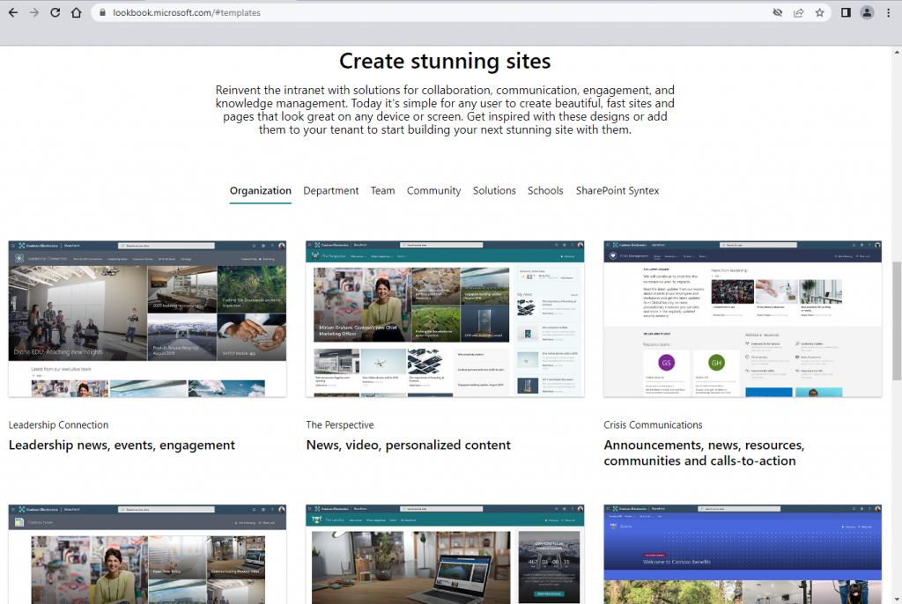
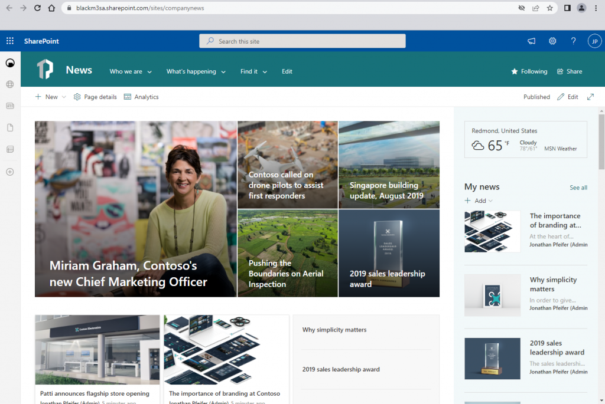

Sooner or later customers want to have SharePoint Online look like everything else within their company. This means customizations of layout and colors. Or does it?

<!--more-->
## Table of content 


In the early days customization of SharePoint's look and feel was a pain in the foot. Modifications of aspx pages, template files or weird CSS hacks were a common practice.

**Note |** Always question the necessity of modifications requested by customers and keep in mind to stay as much as possible within the SharePoint standard configuration. Not only will this save you time and tears but also minimize false expectations of the client - because some things can't be done with SharePoint.  
Another important aspect of less modification is user adoption. When the settings button is not where it commonly is, the user will not be able to leverage any material available on the internet.

## Assumptions

In our example, we will use a newly created communication site and make some changes to it, so it fits the client's corporate identity. That is - for some strange reasons - a weird purple/pink-ish brand.

## What do we cover?

- [**Select a layout from SharePoint Lookbook**](#Select-a-layout-from-SharePoint-Lookbook)
- **[Create a new color palette for SharePoint themes](#Create-a-new-color-palette-for-SharePoint-themes)**
- **[Change the color of the SharePoint suite bar](#Change-the-color-of-the-SharePoint-suite-bar)**

## Select a layout from SharePoint Lookbook

SharePoint Lookbook is a site by Microsoft which provides you with a lot of predefined SharePoint Online layouts based on real-life use cases.



Screenshot of Microsofts Lookbook for SharePoint Online

The approach is fairly simple. Browse the templates on the site, select the one that seems to fit best, add it to your tenant (prompt for permissions and maybe user credentials might appear) and you're good to go.


Create a new site from SharePoint Lookbook template

In my case, I was already logged in with my SharePoint Admin user in another tab. Therefore, I was not asked to log in. The provisioning process takes its time so be patient.

The result looks something like this.



The result of the provisioning process

## Create a new color palette for SharePoint themes

Next, we will try to fulfill our customer's wish to have the site painted orange and green.

SharePoint Online uses a JSON-based approach to define color palettes and other design and layout stuff.

The first thing we need to do is, define our color palette. We can use the **[Fluent UI Themen Designer](https://fabricweb.z5.web.core.windows.net/pr-deploy-site/refs/heads/master/theming-designer/index.html)** for that task.


Using Fluid UI Theme Designer

The last step is to copy the JSON into the clipboard and continue to the next step: Create a SharePoint theme using PowerShell.

Right now we need to do this by using PowerShell. Save the JSON from the tool inside of a PowerShell variable and use Add-SPOTheme to create a new theme in your tenant that can be used with your SharePoint sites.

```powershell
# Load the SharePoint Online module 
# Skip this, if you already have the module at hand 
Import-Module -Name "Microsoft.Online.SharePoint.Powershell" 

# Connect to your tenant 
# You need SharePoint Admin rights 
Connect-SPOService -Url "https://yoursharepoint-admin.sharepoint.com" 

# You'll be prompted for your creds and 2nd factor 
$themeColor = @{
"themePrimary" = "#b364c9";
"themeLighterAlt" = "#fcf8fd";
"themeLighter" = "#f2e3f6";
"themeLight" = "#e7cbef";
"themeTertiary" = "#d09cdf";
"themeSecondary" = "#bc74d0";
"themeDarkAlt" = "#a25bb5";
"themeDark" = "#894d99";
"themeDarker" = "#653871";
"neutralLighterAlt" = "#f5f1f6";
"neutralLighter" = "#f1edf2";
"neutralLight" = "#e7e3e8";
"neutralQuaternaryAlt" = "#d7d4d8";
"neutralQuaternary" = "#cdcace";
"neutralTertiaryAlt" = "#c5c2c6";
"neutralTertiary" = "#a19f9d";
"neutralSecondary" = "#605e5c";
"neutralPrimaryAlt" = "#3b3a39";
"neutralPrimary" = "#323130";
"neutralDark" = "#201f1e";
"black" = "#000000";
"white" = "#fcf8fd";
}

Add-SPOTheme -Identity "My Custom Demo Theme" -Palette $themeColor -IsInverted $false 

# Use -Override to update an existing custom theme 
```

That's it. Now the newly created theme should be available.


Applying our new theme

## Change the color of the SharePoint suite bar

The last thing we want is, to have the blue top bar in the proper color - a light pink.

This is done in the Microsoft 365 Admin portal as global admin.


Changing the suite bar color

## Conclusion

Though it's still a picking on all ends task, changing the look and feel of SharePoint Online became waaaay easier then it was some years ago. And that's just nice.

## References

- **[SharePoint look book](https://lookbook.microsoft.com/)** (Microsoft)  
    \[https://lookbook.microsoft.com/\]
- **[Fluent UI Theme Designer](https://fabricweb.z5.web.core.windows.net/pr-deploy-site/refs/heads/master/theming-designer/index.html)** (Microsoft)  
    \[https://fabricweb.z5.web.core.windows.net/pr-deploy-site/refs/heads/master/theming-designer/index.html\]
- **[SharePoint Online](https://www.microsoft.com/en-us/microsoft-365/sharepoint/collaboration?ms.officeurl=sharepoint)** (Microsoft)  
    \[https://www.microsoft.com/en-us/microsoft-365/sharepoint/collaboration?ms.officeurl=sharepoint\]
