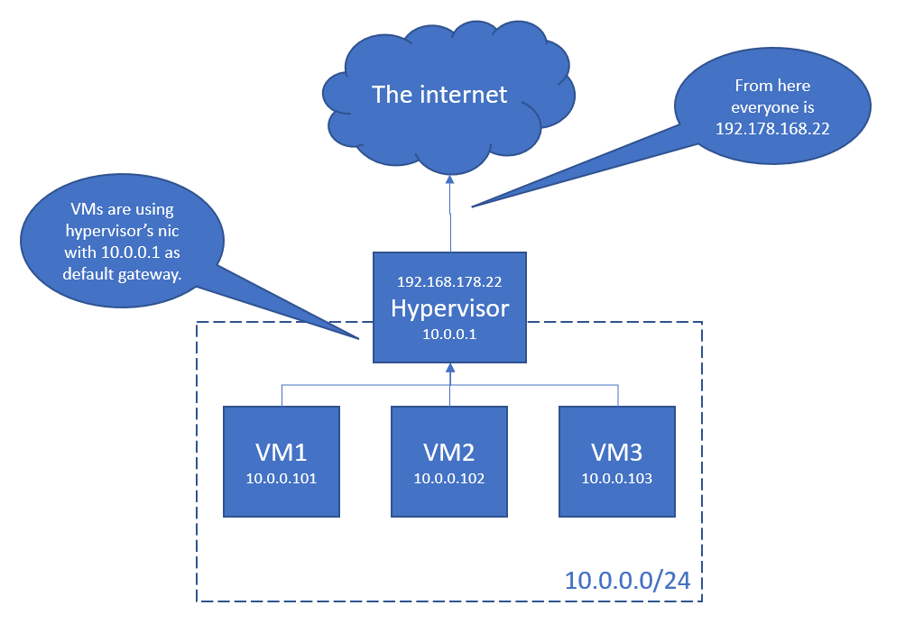
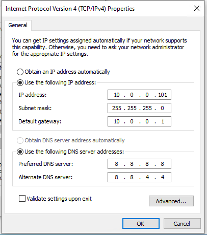

While I've been setting up a lab environment on a Hyper-V host, I was told I cannot use virtual external switches for my VMs. The alternative has to be NAT. So, let's see how this is done.

<!--more-->
## Table of content 


## Content

- [Introduction](#Introduction)
- [How things should end up](#How-things-should-end-up)
- [Setting up NAT for Hyper-V](#Setting-up-NAT-for-Hyper-V)
- [Conclusion](#Conclusion)
- [References](#References)

## Introduction

Hyper-V provides three different types of virtual switches

- **private:** Use this one for networks where the devices shall communicate only within their network. No access to the internet, no access to the host system.
- **internal:** This configuration allows the vm to communicate with other devices within the same network and with the host system.
- **external**: Using this type of switch allows the virtual machine to directly communicate with external networks, e. g. the internet and by-passing the host system.

External switches are sometimes not allowed. This is because multiple (virtual) network interfaces (NIC) can share traffic over one physical NIC and therefore traffic will go out over one interface with probably more than on MAC. Maybe this is considered as MAC Spoofing? I don't know.

Long story short: Had to use an alternative technique to provide internet access for my VMs. Network allocation table (NAT) it is.

## How things should end up

The result is nothing special and shall be like this:

- Hyper-V host: A windows server machine with Hyper-V feature installed. The server has one NIC and plays with the network via IP 192.178.168.22/24
- A virtual network with a range of 10.0.0.0/24 and three devices within this network.
    - vm1 with 10.0.0.101
    - vm2 with 10.0.0.102
    - vm3 with 10.0.0103

**Info |** Some basics before we are going to set up the environment. The **24** shows us how much IPs we have available within our network. This will be **10.0.0.1 - 10.0.0.254**. Short form is **10.0.0.0/24**. We will also read about **ifindex**. This is an index number for network interfaces on a machine. The **default gateway** is the entity which is routing our traffic. And as we don't have a DNS server running, we are going to borrow the ones from Google. These have the IPs **8.8.8.8** and **8.8.4.4**.



This is what we want to achieve.

## Setting up NAT for Hyper-V

We're going through this with only one client - for convenient reasons.

### Info we need

- Network range: 10.0.0.0/24
- VM1
    - IP 10.0.0.101
    - Mask: 255.255.255.0
    - DNS1: 8.8.8.8
    - DNS2: 8.8.4.4
- Name of virtual Switch: DefaultVmGateway
- Name of NAT: DefaultVmGatewayOutside

### Steps on Hyper-V host

Open a PowerShell console as admin and follow along the steps below.

```powershell
// Create a new internal virtual switch (virtual ethernet adapter)
New-VMSwitch -SwitchName 'DefaultVmGateway' -SwitchType 'Internal'

// Get the index number of the new ethernet adapter 
Get-NetAdapter | Select-Object name,ifindex 

// This can for instance be 7 

// Configure NAT gateway 
New-NetIPAddress -IPAddress 10.0.0.1 -PrefixLength 24 -InterfaceIndex 7

// Configure NAT network 
New-NetNat -Name 'DefaultVmGatewayOutside' -InternalIPInterfaceAddressPrefix 10.0.0.0/24 
```

### Step on virtual machine

I'm not going to explain how to create a new virtual machine in Hyper-V. Pretty sure you already know that. If not, see [here](https://learn.microsoft.com/en-us/windows-server/virtualization/hyper-v/get-started/create-a-virtual-machine-in-hyper-v).

Anyways, move to the virtual machine VM1, open a command prompt and type **ncpa.cpl**. This opens the network adapter overview. Click right on the network adapter (there should be only one) and select properties. Choose IPv4 and edit the settings as you can see in the image below.



- IP address: 10.0.0.101
- Subnet mask: 255.255.255.0
- Default gateway: 10.0.0.1
- Preferred DNS server: 8.8.8.8
- Alternate DNS server: 8.8.4.4

Confirm your settings by clicking OK and test your internet access.

You can do a ping or nslookup or tracert or something like this to check if the world is open for your VM.

## Conclusion

As we saw the configuration is fairly simple for a simple setup. Of course you can increase complexity to a level where playing around in a lab might not be fun anymore. But networking is a pretty complex topic and - at least speaking for myself - I lack knowledge and experience for such scenarios.

At the end my VM can talk to the internet and I don't need a 50 headcount devops team to keep it running.

Hope you learned something. I did.  
So long...

## References

- [Set up a NAT network](https://learn.microsoft.com/en-us/virtualization/hyper-v-on-windows/user-guide/setup-nat-network) **[(Microsoft Learn](https://learn.microsoft.com/en-us/virtualization/hyper-v-on-windows/user-guide/setup-nat-network))**
- [Create a virtual machine in Hyper-V](https://learn.microsoft.com/en-us/windows-server/virtualization/hyper-v/get-started/create-a-virtual-machine-in-hyper-v) **[(Microsoft Learn](https://learn.microsoft.com/en-us/windows-server/virtualization/hyper-v/get-started/create-a-virtual-machine-in-hyper-v))**
