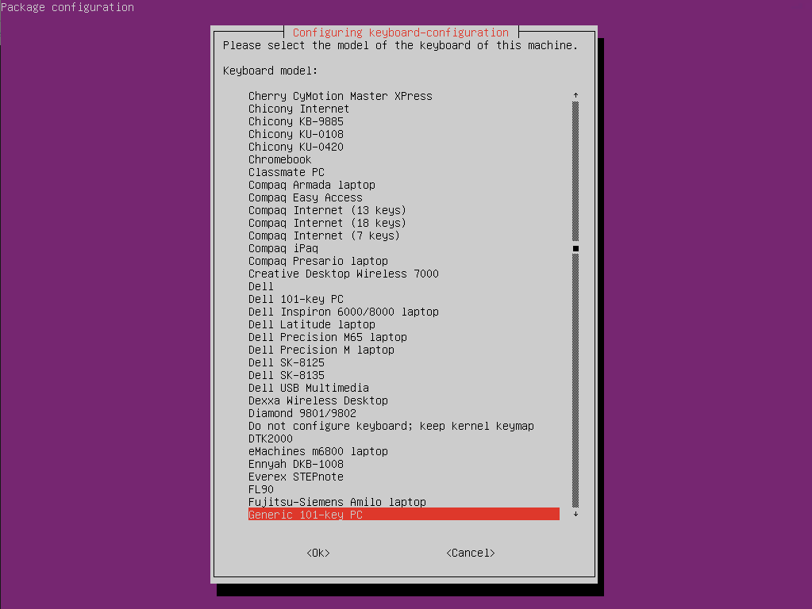

You can change the keyboard layout for Ubuntu within the terminal session via the following statement. 
<!--more-->


```bash {style=nord}
sudo dpkg-reconfigure keyboard-configuration
```



Click through the wizard and configure your keyboard layout as required.

So long…