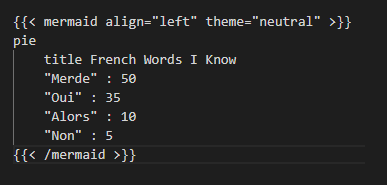
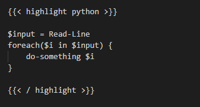

# How to use Hugo for blogging 

HUGO is a static site generator that uses markdown for formatting content. It can be set up locally for preview and deployed to many hosting providers like netlify or GitHub. 

Though said it's one of the easiest ways to quickly set up a blog, this is only true for a very simple and basic blog system. 

As soon as you need search (which is usually a server-side function) or a more sophisticated layout, it can become quite difficult to set up a site. 

Also the day-to-day usage is also not that simple as there is no backend and lot of stuff needs to be done manually and/or on the command line. 

That means it takes a bit to get used to static site generators like HUGO. But as soon as you have a routine, it's pretty nice. 

## Concept of folder-based storage in Hugo 
Hugo stores all items which belong to the same post in one folder. That is the reason why a new blog post is created as a subfolder of **posts**. The content is stored in an **index.md** file, all other stuff - like images, files, etc... - is stored within the same folder. 

### Example structure of a blog post

```bash {style=nord}
site_folder 
|-- content 
    |-- post
        |-- how-to-use-hugo 
            |-- index.md 
            |-- sunflower.png 
            |-- portrait-of-dog.png 

```
### Explaination 
The index.md will contain all the text and markdown for the blog post. The images and files will be referenced in the "Frontmatter" code of the blog post. 

Using this approach, you will have the written content separated from any binary files. And that makes the content easier for machine processing. 

## How to create a new blog post 
Does this mean, I have to manually create the folder structure and files every time I want to make a new blog post? 

Of course not. 

We are using the Hugo CLI for that. And as this is still a bit ArchLinux style overcomplicated and unnessecary awkward, we will later wrap all the calls in a handy PowerShell script. But this is a story for an other day. 

### Create a new blog post with HUGO cli

On level of the hugo site folder, use this statement: 

```bash {style=nord}
hugo new post/name-of-post/index.md
```

### What happens in the background?

In each installation of HUGO and the themes, there is a folder called **archetypes**. This folder contains *.md files which are used as some kind of template. 

The HUGO cli checks for a template in the folder **archetype** and uses this template to create the index.md for the post. 

### Why should I care? 

You can use the files in the folder **archetype** to provide a template with custom "Frontmatter" and predefined structure. This will help you to keep consistency in your writing. 

## Syntax Highlighting 

One important aspect - at least for me - is syntax highlighting. 

That said, there are many different ways to utilize Syntax Highlighting in HUGO. 

One is the build-in fencing which means using three ticks to start and stop a code block. 

### Using fencing for Syntax Highlighting 

You can use
``` code 
\``` powershell {style=nord}
Get-Some -Parameter "Value" 
\```
```
to put a codeblock and some highlighting according to the language. 

### List of supported languages in HUGO 
Check out this list for all supported programming languages in HUGO: 

> https://xyproto.github.io/splash/docs/all.html 

## Using Markdown for the blog content 

I don't want to say too much about markdown as there is already everything said. 

You can find a comprense introduction and further advanced topics on the "official" site. 

> https://www.markdownguide.org/basic-syntax

The beauty of using markdown is, as soon as you get used to the synthax it becomes pretty easy to quickly create content without thinking too much about formatting. 


## Adding Mermaid for diagrams 

Mermaid is a javascript based solution to produce nice diagrams. 

It is not supported out-of-the-box. But the implementation is fairly easy. 

1. Create an html file named **mermaid.html** in the folder 

```bash {style=nord}
site_folder 
|-- themes 
    |-- mytheme
        |-- layouts 
            |-- shortcodes 
                |-- mermaid.html

```

2. Put this inside the file: 

``` html
<script async type="application/javascript" src="https://cdn.jsdelivr.net/npm/mermaid/dist/mermaid.min.js">
  var config = {
    startOnLoad:true,
    theme:'{{ if .Get "theme" }}{{ .Get "theme" }}{{ else }}dark{{ end }}',
    align:'{{ if .Get "align" }}{{ .Get "align" }}{{ else }}center{{ end }}'
  };
  mermaid.initialize(config);
</script>

<div class="mermaid">
  {{.Inner}}
</div>
```
3. Use the shortcut in this image in your *.md file 


### Example diagram

pie
    title French Words I Know
    "Merde" : 50
    "Oui" : 35
    "Alors" : 10
    "Non" : 5


### Further information on how to use Mermaid 
You can find further info and examples on how to use mermaid here: 

> https://mermaid.js.org/ 

## Documentation for the theme

https://stack.jimmycai.com/writing/frontmatter#keywords 


## Further examples of code highlighting


### Simple high lighting using fence and style nord 
```powershell {style=nord}
Get-Item -Path "c:\users\someone\somewhere"
```

### Code high lighting with marking specific lines within the sample 
```powershell {linenos=table,hl_lines=[1,"4-5"],linenostart=1,style=nord}
Get-Item 
Get-Computer 
Remove-Service -Parameter "Value" - Parameter2 "Another Value" -URL "https://a-very-long-subdomain.domain-with-fancy-value.tld" 
Clear 
Do-SomethingElse -Parameter "Value"
```

### High lighting with a different approach 





$input = Read-Line 
foreach($i in $input) {
    do-something $i
}



***
So long... 

