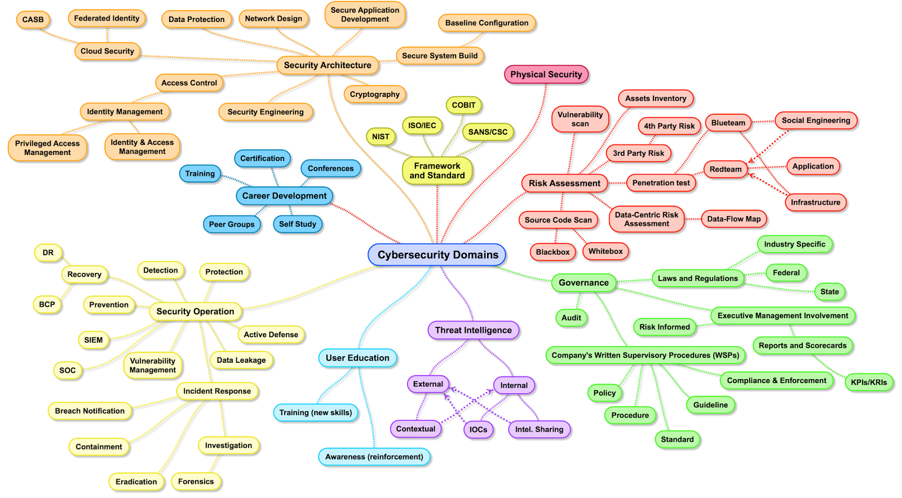

In this post we will take a look at tasks and purposes of a Security Operations Center. A brief introduction. 

<!--more-->
## Table of content 


## What will be covered? 
This post gives a brief overview of what a Security Operations Center (SOC) is for and what skills are helpful to start as a cyber security analyst.

The SOC is set up in a Microsoft environment using the Microsoft Defender suite and Sentinel.

*** 
## What is a Security Operations Center for?

A Security Operations Center (SOC) is part of IT operations (vs. Consulting and Management). The analysts of the SOC are responsible for monitoring security-related incidents, analysis of the root cause, and proper remediation action.

Usually, the SOC is part of the company's internal IT department. However, nowadays, it is also common to have security topics handled by external companies with reasonable proficiency. This is called a managed SOC.

*** 
## What does a SOC analyst do? 
As the main focus of the SOC is to monitor, analyze and remediate security-related incidents, this is also the main working area for the cyber security analyst.

### Triage
The analyst often uses a playbook to decide if an incident is a valid threat or if the system just raised an alert on false assumptions. This triage is the first thing a cybersecurity analyst should master.

In most cases, further analysis is required to make a proper decision, whether the threat is real or not. For this, the analyst needs to know the Security Portal and where to get the information to make this decision.

In most cases further analysis is required to make a sound decision, whether the threat is real or not. For this the analyst needs to know the Security Portal and where to get the information to make this decision. 

### Incident Response 
If the incident is confirmed as a so-called true positive, meaning that an actual threat exists, the analyst needs to understand the threat and its impact. This understanding comes from experience, research (e.g., Google), or colleagues' shared experience. Based on the research or investigation, the analyst performs proper remediation actions or communicates to the customer's IT department.

### Automation 
Many repetitive tasks require much time with' little' outcome. That is why people in IT operations focus on the automation of tasks. The more tasks are done in the background by the system itself, the more time is free to improve efficiency or lead other topics.

### Summary 
- monitoring incidents
- analyzing root causes, risk assessment, and remediation actions
- take out remediation action and communicate to the customer's IT department
- automate repetitive tasks

*** 
## Specialization
A SOC analyst often has a specialization in addition to the daily work. 
As the cybersecurity field is so huge, it is a good idea that people specialize in specific areas to get proficient knowledge. 

The following image describes some of the sub-fields.

### APT (Advanced Persistent Threat)
APT or Advanced Persistent Threat stands for an imminent attack that must be stopped promptly. Personnel needs a profound understanding of tools, techniques, and proper remediation actions.

APTs are part of the incident response and often result from an ongoing investigation as part of triage or an actual breach where customers call for help during an ongoing attack.
As these actions are done under a certain amount of pressure promptly, it is essential to have skilled people with high proficiency in this field.

#### Summary 
- Part of incident response
- requires a deep understanding of incident response and remediation action
- time-sensitive action
- required during ongoing attacks (e. g. ransomware)

### Digital Forensics

Many times digital forensics is part of an ongoing or afore-made Incident Response. The forensic analyst will provide a sound report with evidence of how something happened. The five most important questions to answer in that report are:

- Who did
- What
- When
- Where
- and Why?

Of course, the How will also be answered if applicable.
Knowing what happened is needed to understand how to prevent future attacks. This whole investigation is done in a very formal way to make sure actions are transparent and replicable. The analyst will need a wide variety of tools that are only sometimes easy and intuitive.

Often, insurance or criminal prosecution expects the digital forensic analyst's report as an outcome. 

#### Summary 
- Part of DFIR
- Get evidence of malicious activity
- required for insurance and criminal prosecution
- required for post-mortem
- Sometimes part of APT

### Malware analysis 

Sometimes the digital forensics analysis will bring the used malware as an outcome. 

To understand the malware's capabilities and to extract IoCs - if there are any - a malware analyst reverse-engineers the malicious software and extracts any helpful information. 

Malware analysis requires an understanding of software development, various tools and frameworks, and a systematic and careful mode of proceeding.

#### Summary 
- reverse engineering of malware
- understand the capabilities of the malware
- get IoCs for further investigation
- required for further incident prevention
- Part of Digital Forensics

### Threat Intelligence 
The people of Threat Intelligence gather cybersecurity-related information from everywhere. This can be freely available information, paid services, or data from own investigations (incident response, forensics, malware analysis).

All this information is processed, analyzed according to specified requirements, and provided as reports. The whole process takes much time, reading, and also tooling.

#### Summary 
- gathering and processing information about current threats
- analyzing information if relevant for own requirements
- prediction of future threats
- Uses open/paid source feeds and information gathered by incident responses, forensics, and malware analysis

### Threat hunting 
Using the information provided by Threat Intel, security analysts can use Hunting to proactively look for any - maybe until now - undetected or upcoming threats.

For this task, Microsoft leverages KQL with Advanced Hunting in Microsoft Defender or Queries in Sentinel. KQL is a query language similar to SQL, though the engine is optimized for searching large amounts of data - especially in cloud environments.

#### Summary 
- proactive search for probably undetected threats in own environment
- setting up continuous detection of threats (Custom Detections, Queries in Sentinel)
- Uses information from Threat Intelligence

*** 
## Required skills for a SOC analyst? 
An upcoming SOC analyst should be in a calm mood and stay calm even under pressure. Curiosity and the will to continue learning are also advantageous to quickly adapting to new situations.

For daily work, critical thinking and a fair amount of paranoia will also be good companions.

Speaking of technical or hard skills, the analyst needs to know the Microsoft Defender suite and KQL as the language for performing queries and retaining information during investigations.

Experience in scripting, git, and GitHub is fortunate but not a hard requirement.
Finally, the analyst should be able to communicate and document information correctly, as sharing is a crucial point in most fields of IT nowadays.

*** 
## Conclusion 

Of course, many more factors are involved in determining if someone can do the work of a cyber security analyst in a Security Operations Center. Moreover, if the candidate can quickly adapt, that is essential.

By the way, what is not a requirement is wearing a black hoodie.

— So long
